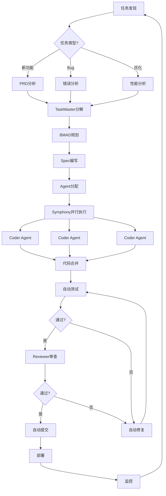

# 🚀 DevFlow - AI驱动全自治开发系统

> **让AI Agent 24/7自动开发、测试、部署你的项目**

基于OpenClaw Skills架构，集成TaskMaster、BMAD、Symphony等先进方法论，实现完全自治的AI开发流水线。

## 🎯 核心特性

- **🤖 完全自治** - AI自动发现任务、编写代码、运行测试、提交PR
- **🔄 24/7运行** - 定时监控，持续迭代，永不停歇
- **🧠 智能记忆** - 从每次开发中学习，不断进化
- **🎯 多Agent协作** - Planner、Coder、Reviewer、Deployer协同工作
- **📊 实时监控** - Dashboard可视化，随时掌握进度
- **🛡️ 安全隔离** - Git Worktree隔离，主分支永远安全
- **🤖 多模型支持** - 集成Claude、GPT、本地模型，智能选择最优方案

## 🏗️ 架构设计

### 核心组件

```
DevFlow/
├── skills/                    # OpenClaw Skills
│   ├── taskmaster/           # TaskMaster-AI集成
│   ├── bmad/                 # BMAD方法论
│   ├── symphony/             # Symphony并行执行
│   ├── spec-driven/          # Spec Driven Development
│   ├── orchestrator/         # 多Agent编排器
│   ├── monitor/              # 系统监控
│   └── evolution/            # 自我进化引擎
├── agents/                    # Agent实现
│   ├── planner.py            # 任务规划Agent
│   ├── coder.py              # 代码编写Agent
│   ├── reviewer.py           # 代码审查Agent
│   ├── tester.py             # 测试Agent
│   └── deployer.py           # 部署Agent
├── core/                      # 核心模块
│   ├── model_manager.py      # 模型管理器
│   ├── model_selector.py     # 智能模型选择
│   ├── model_metrics.py      # 性能监控
│   └── agent_manager.py      # Agent管理
├── scripts/                   # 自动化脚本
│   ├── auto-discover.sh      # 自动发现任务
│   ├── auto-commit.sh        # 自动提交
│   ├── auto-monitor.sh       # 自动监控
│   └── start-tmux.sh         # 启动tmux会话
├── dashboard/                 # Web Dashboard
│   ├── backend/              # Node.js后端
│   └── frontend/             # React前端
└── config/                    # 配置文件
    ├── model_config.json     # 模型配置
    ├── agents.json           # Agent配置
    ├── workflows.json        # 工作流配置
    └── tmux.conf             # Tmux配置
```

### 工作流程



## 🚀 快速开始

### 1. 安装依赖

```bash
# 安装OpenClaw
npm install -g openclaw

# 安装项目依赖
cd devflow
npm install
pip install -r requirements.txt
```

### 2. 配置环境

```bash
# 复制配置模板
cp config/agents.json.example config/agents.json
cp config/workflows.json.example config/workflows.json

# 编辑配置
vim config/agents.json
```

### 3. 启动系统

```bash
# 启动tmux会话（后台运行）
./scripts/start-tmux.sh

# 启动自动监控
./scripts/auto-monitor.sh

# 启动Dashboard
cd dashboard && npm run dev
```

### 4. 访问Dashboard

打开浏览器访问：http://localhost:5173

## 📚 集成的方法论

### 1. TaskMaster-AI
- 自动分解PRD为可执行任务
- 智能任务优先级排序
- 依赖关系自动解析

**Skill**: `skills/taskmaster/SKILL.md`

### 2. BMAD (BMAD-METHOD)
- 21个专业Agent角色
- 敏捷开发最佳实践
- 代码质量保障流程

**Skill**: `skills/bmad/SKILL.md`

### 3. Spec Driven Development
- 先写规格，后写代码
- 自动生成测试用例
- 文档与代码同步

**Skill**: `skills/spec-driven/SKILL.md`

### 4. Symphony
- 并行Agent执行
- 智能任务调度
- 资源优化分配

**Skill**: `skills/symphony/SKILL.md`

### 5. 多模型支持 (Multi-Model Support)
- 支持Claude、GPT、本地模型等多个AI提供商
- 基于任务类型自动选择最优模型
- 智能故障转移机制
- 成本优化与性能监控

**配置**: `config/model_config.json`
**文档**: [MODEL_USAGE.md](./docs/MODEL_USAGE.md)

## 🎮 使用场景

### 场景1：新项目开发
```bash
# 1. 创建PRD文档
echo "# 贪吃蛇大作战\n\n## 功能需求\n..." > PRD.md

# 2. 启动自动开发
./devflow start --prd PRD.md

# 3. 监控进度
open http://localhost:5173
```

### 场景2：持续维护
```bash
# 1. 启动持续监控
./devflow monitor --interval 5min

# 2. 自动处理：
# - 测试失败自动修复
# - Lint错误自动修复
# - 安全漏洞自动修复
# - 性能问题自动优化
```

### 场景3：多项目并行
```bash
# 1. 添加多个项目
./devflow add-project /path/to/project1
./devflow add-project /path/to/project2

# 2. 启动并行开发
./devflow start --parallel 4

# 3. 查看所有项目状态
./devflow status
```

## 📊 性能指标

### Peter Steinberger模式
- **目标**: 627 commits/day
- **粒度**: 每次3-5行代码
- **频率**: 平均11秒/次提交
- **测试**: 每次提交自动测试

### DevFlow优化
- **并发Agent**: 最多12个
- **任务队列**: 智能优先级调度
- **失败重试**: 自动重试3次
- **记忆学习**: 从失败中进化

## 🛠️ 高级配置

### 多模型配置

DevFlow支持多个AI模型，自动根据任务类型选择最优方案：

```json
{
  "providers": {
    "anthropic": {
      "enabled": true,
      "models": {
        "claude-3-5-sonnet-20241022": {
          "capabilities": ["code_generation", "code_review"],
          "priority": 1
        }
      }
    },
    "openai": {
      "enabled": true,
      "models": {
        "gpt-4-turbo": {
          "capabilities": ["analysis", "writing"],
          "priority": 2
        }
      }
    }
  },
  "task_mappings": {
    "code_generation": {
      "preferred_models": ["anthropic/claude-3-5-sonnet-20241022"],
      "fallback_models": ["openai/gpt-4-turbo"]
    }
  }
}
```

**配置文件**: `config/model_config.json`
**详细文档**: [MODEL_USAGE.md](./docs/MODEL_USAGE.md)

**支持的提供商**:
- **Anthropic**: Claude 3.5 Sonnet, Claude 3 Opus, Claude 3 Haiku
- **OpenAI**: GPT-4 Turbo, GPT-4, GPT-3.5 Turbo
- **本地模型**: Llama, CodeLlama (通过Ollama)

**选择策略**:
- `balanced`: 平衡成本、速度和质量（默认）
- `cost_optimized`: 优先考虑成本
- `quality_optimized`: 优先考虑质量
- `speed_optimized`: 优先考虑速度

### 自定义Agent

```json
{
  "custom_agents": [
    {
      "name": "security-scanner",
      "model": "claude-3-opus",
      "skills": ["security-analysis", "vulnerability-detection"],
      "schedule": "0 */6 * * *"
    }
  ]
}
```

### 自定义工作流

```json
{
  "workflows": [
    {
      "name": "security-fix",
      "trigger": "vulnerability-detected",
      "steps": [
        {"agent": "security-analyzer", "action": "analyze"},
        {"agent": "coder", "action": "fix"},
        {"agent": "tester", "action": "verify"},
        {"agent": "deployer", "action": "deploy"}
      ]
    }
  ]
}
```

## 📖 文档

- [架构设计](./docs/ARCHITECTURE.md)
- [配置指南](./docs/CONFIGURATION.md)
- [多模型使用指南](./docs/MODEL_USAGE.md) - 模型配置与选择策略
- [API文档](./docs/API.md)
- [最佳实践](./docs/BEST_PRACTICES.md)
- [故障排查](./docs/TROUBLESHOOTING.md)

## 🤝 贡献

欢迎贡献！请查看 [CONTRIBUTING.md](./CONTRIBUTING.md)

## 📝 License

MIT License

## 🙏 致谢

- [OpenClaw](https://github.com/openclaw/openclaw) - 底层框架
- [TaskMaster-AI](https://github.com/eyaltoledano/claude-task-master) - 任务管理
- [BMAD-METHOD](https://github.com/bmad-code-org/BMAD-METHOD) - 敏捷方法论
- [Symphony](https://github.com/openai/symphony) - 并行执行
- [Auto-Claude](https://github.com/AndyMik90/Auto-Claude) - 参考实现

---

**开发状态**: 🚧 开发中
**版本**: 0.1.0
**最后更新**: 2026-03-07

---

# Autonomous AI Development System

A fully autonomous software development system built with OpenClaw, BMad Method, and Taskmaster AI, inspired by OpenAI's "Harness" experiment.

## Quick Start

See [QUICKSTART.md](QUICKSTART.md) for immediate next steps.

## Overview

This system orchestrates multiple AI agents to automatically:
- Analyze requirements and create specifications
- Design system architecture
- Implement features with TDD
- Review code and run tests
- Deploy and monitor applications

**Core Philosophy**: Humans steer. Agents execute.

## What Just Happened

I've created the foundation of an autonomous AI development system with:

### ✅ Created Directory Structure
```
devflow/
├── skills/              # Agent skills (planning, development, quality, deployment)
├── workflows/           # Workflow definitions
├── tools/              # Infrastructure tools (tmux, git worktrees)
├── docs/               # Documentation
├── templates/          # Templates and configs
└── scripts/            # Automation scripts
```

### Key Files Created
- `docs/agentry/AGENTS.md` - The "map" for agents (progressive disclosure)
- `skills/planning/product-owner-skill.md` - Generate product briefs
- `skills/development/dev-story-skill.md` - Implement with TDD
- `tools/tmux-manager/spawn-session.sh` - Background session management
- `tools/git-worktree-manager/create-worktree.sh` - Isolated testing
- `scripts/run-bmad-workflow.sh` - Complete BMad workflow runner

## Documentation

- **[QUICKSTART.md](QUICKSTART.md)** - Get started immediately
- **[ARCHITECTURE.md](ARCHITECTURE.md)** - System architecture
- **[PROJECT_PLAN.md](PROJECT_PLAN.md)** - Implementation roadmap
- **[docs/agentry/AGENTS.md](docs/agentry/AGENTS.md)** - Agent navigation guide
