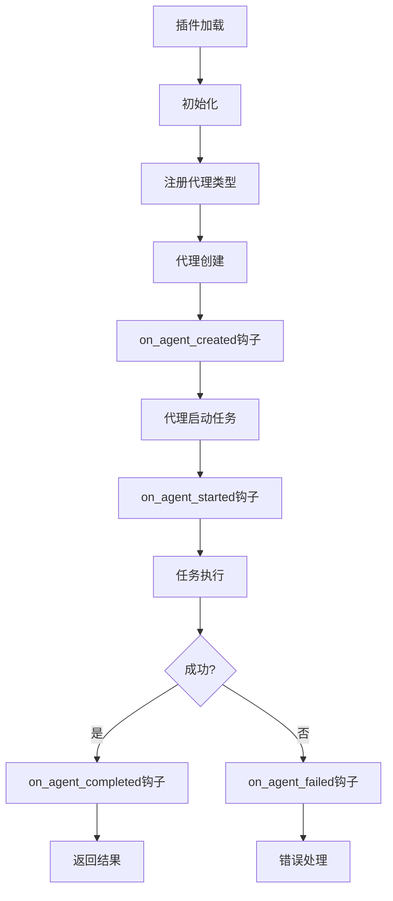

# Custom Agent Plugin

> Example plugin demonstrating custom agent implementation

## 概述

Custom Agent Plugin是一个示例插件，展示如何在DevFlow中创建自定义代理（agent）。该插件实现了一个专门的代码审查代理，具有自定义行为和生命周期钩子。

## 核心功能

### 1. 自定义代理类型
- 注册新的代理类型 "custom-code-reviewer"
- 完全自定义的代理配置
- 专用的技能集和系统提示

### 2. 生命周期管理
- `on_agent_created`: 代理创建时的钩子
- `on_agent_started`: 代理开始任务时的钩子
- `on_agent_completed`: 代理完成任务时的钩子
- `on_agent_failed`: 代理失败时的钩子

### 3. 可配置行为
- 模型选择（Claude 3.5 Sonnet）
- 温度参数控制
- 最大令牌数
- 超时设置
- 并发任务数

### 4. 专业代码审查
- 安全漏洞检测
- 性能分析
- 可维护性评估
- 架构建议

## 使用方法

### 在DevFlow中使用

```python
from devflow.plugins.plugin_loader import PluginLoader
from devflow.plugins.agent_plugin import agent_plugin_registry

# 加载插件
loader = PluginLoader()
loader.load_plugin("examples/plugins/custom_agent")

# 获取插件配置
config = agent_plugin_registry.get_agent_config("custom-code-reviewer")

# 创建代理实例
from devflow.core.agent_manager import AgentManager

manager = AgentManager()
agent_plugin_registry.integrate_with_agent_manager(manager)

# 使用自定义代理
agent = manager.create_agent("custom-code-reviewer")
result = agent.execute("Review this code for security issues...")
```

### 直接使用插件类

```python
from examples.plugins.custom_agent import CustomAgentPlugin

# 创建插件实例
plugin = CustomAgentPlugin()

# 获取元数据
metadata = plugin.get_metadata()
print(f"Plugin: {metadata.name} v{metadata.version}")

# 获取代理配置
config = plugin.get_agent_config()
print(f"Model: {config['model']}")
print(f"Skills: {config['skills']}")

# 初始化并启动插件
plugin.initialize()
plugin.start()
```

### 通过配置文件使用

```json
{
  "plugins": [
    {
      "name": "custom-agent",
      "path": "examples/plugins/custom_agent",
      "enabled": true,
      "config": {
        "model": "claude-3-5-sonnet-20241022",
        "max_tasks": 5,
        "temperature": 0.2
      }
    }
  ]
}
```

## 配置

### 插件配置选项

```python
{
  "model": "claude-3-5-sonnet-20241022",  # 使用的模型
  "max_tasks": 3,                         # 最大并发任务数
  "timeout": 1800,                        # 任务超时时间（秒）
  "skills": [                             # 代理技能列表
    "code-review",
    "security-analysis",
    "performance-analysis"
  ],
  "system_prompt": "...",                 # 系统提示
  "temperature": 0.3,                     # 温度参数（0-1）
  "max_tokens": 4000                      # 最大输出令牌数
}
```

### 环境变量

```bash
# 设置自定义模型
export CUSTOM_AGENT_MODEL=claude-3-opus-20240229

# 设置任务超时
export CUSTOM_AGENT_TIMEOUT=3600

# 启用调试日志
export CUSTOM_AGENT_DEBUG=true
```

## 代理类型

### custom-code-reviewer

专门的代码审查代理，具有以下特点：

**技能**:
- 代码审查 (code-review)
- 安全分析 (security-analysis)
- 性能分析 (performance-analysis)

**系统提示**:
```
You are an expert code reviewer with deep knowledge of:
- Software architecture and design patterns
- Security best practices and vulnerability detection
- Performance optimization techniques
- Code maintainability and readability

When reviewing code:
1. Identify potential bugs and edge cases
2. Suggest improvements for performance and readability
3. Check for security vulnerabilities
4. Verify adherence to coding standards
5. Provide clear, actionable feedback

Be constructive and educational in your feedback.
```

**配置示例**:
```python
config = {
    "model": "claude-3-5-sonnet-20241022",
    "temperature": 0.3,
    "max_tokens": 4000,
    "skills": ["code-review", "security-analysis", "performance-analysis"]
}
```

## 工作流程



## 集成示例

### 与任务调度器集成

```python
from devflow.core.task_scheduler import TaskScheduler
from devflow.plugins.agent_plugin import agent_plugin_registry

scheduler = TaskScheduler()

# 注册自定义代理
agent_plugin_registry.integrate_with_agent_manager(scheduler.agent_manager)

# 分配代码审查任务
task = {
    "type": "code-review",
    "agent_type": "custom-code-reviewer",
    "description": "Review authentication module",
    "files": ["src/auth.py"]
}

scheduler.schedule_task(task)
```

### 与CI/CD集成

```python
# .github/workflows/code-review.yml
name: Code Review

on: [pull_request]

jobs:
  review:
    runs-on: ubuntu-latest
    steps:
      - uses: actions/checkout@v2
      - name: Run Custom Agent Review
        run: |
          python -c "
          from examples.plugins.custom_agent import CustomAgentPlugin
          from devflow.core.agent_manager import AgentManager

          plugin = CustomAgentPlugin()
          manager = AgentManager()
          plugin.register_agent(manager)

          agent = manager.create_agent('custom-code-reviewer')
          result = agent.execute_review('pr_diff.patch')
          print(result)
          "
```

### 与日志系统集成

```python
import logging
from examples.plugins.custom_agent import CustomAgentPlugin

# 配置日志
logging.basicConfig(
    level=logging.INFO,
    format='%(asctime)s - %(name)s - %(levelname)s - %(message)s',
    handlers=[
        logging.FileHandler('agent.log'),
        logging.StreamHandler()
    ]
)

# 创建插件
plugin = CustomAgentPlugin()
plugin.initialize()

# 所有生命周期事件都会被记录
plugin.start()
```

## 最佳实践

### 1. 插件开发

**继承正确的基类**:
```python
from devflow.plugins.agent_plugin import AgentPlugin

class MyPlugin(AgentPlugin):
    # 正确的实现
    pass
```

**实现必需方法**:
```python
def get_metadata(self) -> PluginMetadata:
    return PluginMetadata(
        name="my-plugin",
        version="1.0.0",
        description="My custom plugin",
        author="Your Name",
        plugin_type="agent"
    )

def get_agent_type(self) -> str:
    return "my-agent-type"

def get_agent_config(self) -> Dict[str, Any]:
    return {"model": "claude-3-5-sonnet-20241022"}
```

### 2. 系统提示设计

**明确角色定位**:
```
You are an expert in [domain] with specialization in [specific areas].
```

**定义工作流程**:
```
When [action]:
1. [Step 1]
2. [Step 2]
3. [Step 3]
```

**设置输出格式**:
```
Provide feedback in the following format:
- [Category]: [Finding]
- [Severity]: [High/Medium/Low]
- [Suggestion]: [Recommendation]
```

### 3. 生命周期钩子使用

**on_agent_created**: 用于一次性初始化
```python
def on_agent_created(self, agent_id: str, agent_type: str):
    # 加载模板、设置工具等
    self.load_review_templates()
    self.setup_analysis_tools()
```

**on_agent_started**: 用于任务级别的初始化
```python
def on_agent_started(self, agent_id: str, task: str):
    # 记录开始时间、初始化任务上下文
    self.task_start_times[agent_id] = datetime.now()
```

**on_agent_completed**: 用于结果处理
```python
def on_agent_completed(self, agent_id: str, result: Any):
    # 保存结果、更新指标、发送通知
    self.save_review_result(agent_id, result)
    self.update_metrics(agent_id)
```

**on_agent_failed**: 用于错误处理
```python
def on_agent_failed(self, agent_id: str, error: Exception):
    # 记录错误、触发警报、清理资源
    logger.error(f"Agent {agent_id} failed: {error}")
    self.cleanup_agent_resources(agent_id)
```

### 4. 配置管理

**使用合理的默认值**:
```python
def get_agent_config(self) -> Dict[str, Any]:
    return {
        "model": "claude-3-5-sonnet-20241022",
        "temperature": 0.3,  # 适合分析任务
        "max_tokens": 4000,
        "timeout": 1800
    }
```

**支持配置覆盖**:
```python
def __init__(self, config: Dict[str, Any] = None):
    super().__init__(config)
    self.custom_config = config or {}
```

## 故障排查

### 问题：代理未注册

**症状**: `Agent type 'custom-code-reviewer' not found`

**解决方案**:
```python
# 确保插件已加载
from devflow.plugins.plugin_loader import PluginLoader

loader = PluginLoader()
plugin = loader.load_plugin("examples/plugins/custom_agent")

# 确保已注册到agent manager
agent_plugin_registry.integrate_with_agent_manager(agent_manager)
```

### 问题：钩子未被调用

**症状**: 生命周期钩子没有执行

**解决方案**:
```python
# 确保在注册前设置了钩子
plugin = CustomAgentPlugin()
plugin.initialize()  # 初始化插件
plugin.register_agent(agent_manager)  # 注册代理

# 检查日志
logger.setLevel(logging.DEBUG)
```

### 问题：配置未生效

**症状**: 代理使用了默认配置而非自定义配置

**解决方案**:
```python
# 在创建插件时传递配置
config = {
    "model": "claude-3-opus-20240229",
    "temperature": 0.2
}
plugin = CustomAgentPlugin(config=config)

# 或通过配置文件加载
loader.load_plugin("path/to/plugin", config=config)
```

## API参考

### CustomAgentPlugin类

```python
class CustomAgentPlugin(AgentPlugin):
    """Example custom agent plugin."""

    def get_metadata(self) -> PluginMetadata:
        """Get plugin metadata."""
        pass

    def get_agent_type(self) -> str:
        """Get agent type identifier."""
        return "custom-code-reviewer"

    def get_agent_config(self) -> Dict[str, Any]:
        """Get default agent configuration."""
        return {
            "model": "claude-3-5-sonnet-20241022",
            "skills": ["code-review"],
            "system_prompt": "..."
        }

    def on_agent_created(self, agent_id: str, agent_type: str) -> None:
        """Hook called when agent is created."""
        pass

    def on_agent_started(self, agent_id: str, task: str) -> None:
        """Hook called when agent starts a task."""
        pass

    def on_agent_completed(self, agent_id: str, result: Any) -> None:
        """Hook called when agent completes a task."""
        pass

    def on_agent_failed(self, agent_id: str, error: Exception) -> None:
        """Hook called when agent fails."""
        pass
```

### 配置参数

| 参数 | 类型 | 默认值 | 描述 |
|------|------|--------|------|
| `model` | str | "claude-3-5-sonnet-20241022" | 使用的AI模型 |
| `max_tasks` | int | 3 | 最大并发任务数 |
| `timeout` | int | 1800 | 任务超时时间（秒） |
| `skills` | List[str] | ["code-review", ...] | 代理技能列表 |
| `system_prompt` | str | - | 系统提示文本 |
| `temperature` | float | 0.3 | 生成温度（0-1） |
| `max_tokens` | int | 4000 | 最大输出令牌数 |

## 扩展阅读

- [DevFlow Plugin Development Guide](../../docs/plugin-development.md)
- [Agent Plugin Base Classes](../../../devflow/plugins/agent_plugin.py)
- [Plugin System Architecture](../../../devflow/plugins/README.md)
- [Custom Agent Examples](https://github.com/devflow/examples)

---

**版本**: 1.0.0
**更新日期**: 2026-03-07
**作者**: DevFlow Team
**许可证**: MIT
