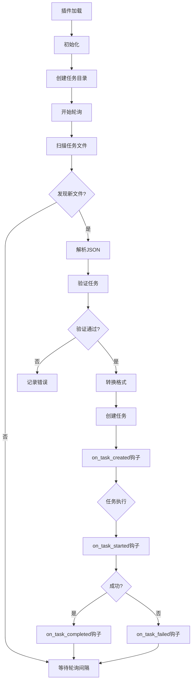

# Custom Task Source Plugin

> Example plugin demonstrating custom task source implementation

## 概述

Custom Task Source Plugin是一个示例插件，展示如何在DevFlow中创建自定义任务源。该插件实现了基于文件的任务源，可以从JSON文件中读取任务并自动导入到DevFlow系统中。

## 核心功能

### 1. 文件任务源
- 从指定目录读取JSON格式的任务文件
- 支持通配符模式匹配文件
- 自动创建任务目录和示例文件
- 支持任务元数据和自定义字段

### 2. 任务验证与转换
- 验证任务必需字段
- 检查任务类型和优先级有效性
- 任务去重机制
- 自动转换为DevFlow任务格式

### 3. 轮询机制
- 可配置的轮询间隔
- 自动发现新任务
- 后台线程运行
- 优雅启停控制

### 4. 生命周期钩子
- `on_task_created`: 任务创建时的钩子
- `on_task_started`: 任务开始执行时的钩子
- `on_task_completed`: 任务完成时的钩子
- `on_task_failed`: 任务失败时的钩子

## 使用方法

### 在DevFlow中使用

```python
from devflow.plugins.plugin_loader import PluginLoader
from devflow.plugins.task_source_plugin import task_source_registry

# 加载插件
loader = PluginLoader()
loader.load_plugin("examples/plugins/custom_task_source")

# 获取插件状态
plugin = task_source_registry.get_task_source_plugin("file-tasks")
status = plugin.get_source_status()
print(f"Task directory: {status['task_directory']}")
print(f"Task files: {status['task_files']}")
```

### 与任务调度器集成

```python
from devflow.core.task_scheduler import TaskScheduler
from devflow.plugins.task_source_plugin import task_source_registry

# 创建任务调度器
scheduler = TaskScheduler()

# 注册任务源插件
task_source_registry.integrate_with_task_scheduler(scheduler)

# 插件将自动开始轮询并创建任务
```

### 创建任务文件

在任务目录中创建JSON文件（默认为 `./tasks/*.json`）：

```json
{
  "id": "task-001",
  "title": "实现用户认证功能",
  "description": "使用JWT实现用户登录和注册功能",
  "type": "development",
  "priority": 1,
  "agent_type": "general",
  "tags": ["auth", "security"],
  "dependencies": [],
  "timeout": 3600,
  "max_retries": 3
}
```

### 批量创建任务

```json
[
  {
    "id": "task-001",
    "title": "设计数据库schema",
    "type": "development",
    "priority": 1,
    "agent_type": "architect"
  },
  {
    "id": "task-002",
    "title": "编写单元测试",
    "type": "testing",
    "priority": 2,
    "agent_type": "tester",
    "dependencies": ["task-001"]
  },
  {
    "id": "task-003",
    "title": "部署到测试环境",
    "type": "deployment",
    "priority": 3,
    "agent_type": "devops"
  }
]
```

## 配置

### 插件配置选项

```python
{
  "task_dir": "./tasks",           # 任务文件目录
  "polling_interval": 60,          # 轮询间隔（秒）
  "file_pattern": "*.json",        # 文件匹配模式
  "auto_process": true             # 自动处理任务
}
```

### 通过配置文件使用

```json
{
  "plugins": [
    {
      "name": "custom-task-source",
      "path": "examples/plugins/custom_task_source",
      "enabled": true,
      "config": {
        "task_dir": "/path/to/tasks",
        "polling_interval": 30,
        "file_pattern": "*.json"
      }
    }
  ]
}
```

### 环境变量

```bash
# 设置任务目录
export TASK_SOURCE_DIR=/path/to/tasks

# 设置轮询间隔
export TASK_SOURCE_POLLING_INTERVAL=30

# 启用调试日志
export TASK_SOURCE_DEBUG=true
```

## 任务格式

### 标准任务格式

```json
{
  "id": "unique-task-id",
  "title": "任务标题",
  "description": "详细描述",
  "type": "development|testing|deployment|maintenance|general",
  "priority": 1-10,
  "agent_type": "agent类型",
  "tags": ["tag1", "tag2"],
  "dependencies": ["task-id-1", "task-id-2"],
  "timeout": 3600,
  "max_retries": 3
}
```

### 扩展字段支持

插件支持额外的自定义字段，这些字段将保存在任务的 `input_data.metadata.custom_fields` 中：

```json
{
  "id": "task-001",
  "title": "主标题",
  "type": "development",
  "priority": 5,

  "custom_field_1": "value1",
  "custom_field_2": 42,
  "custom_object": {
    "key": "value"
  }
}
```

### 任务类型

| 类型 | 描述 | 推荐代理 |
|------|------|----------|
| `development` | 开发任务 | general, coder |
| `testing` | 测试任务 | tester |
| `deployment` | 部署任务 | devops |
| `maintenance` | 维护任务 | maintainer |
| `general` | 通用任务 | general |

### 优先级范围

- `1-3`: 高优先级（紧急任务）
- `4-7`: 中优先级（常规任务）
- `8-10`: 低优先级（可选任务）

## 工作流程



## 集成示例

### 与CI/CD集成

```python
# CI/CD流水线中创建任务文件
import json
from pathlib import Path

def create_task_from_pipeline(pr_number, title, description):
    """在CI/CD流水线中创建任务"""
    task = {
        "id": f"pr-{pr_number}",
        "title": title,
        "description": description,
        "type": "testing",
        "priority": 2,
        "agent_type": "tester",
        "tags": ["ci-cd", "pr-review"]
    }

    task_dir = Path("./tasks")
    task_dir.mkdir(exist_ok=True)

    task_file = task_dir / f"pr-{pr_number}.json"
    with open(task_file, 'w') as f:
        json.dump(task, f, indent=2)

    print(f"Created task: {task_file}")
```

### 与外部系统集成

```python
import requests
import json
from pathlib import Path

def sync_tasks_from_jira(jira_url, project_key):
    """从Jira同步任务到DevFlow"""
    # 获取Jira任务
    response = requests.get(f"{jira_url}/rest/api/2/search?jql=project={project_key}")
    issues = response.json()['issues']

    # 创建任务文件
    task_dir = Path("./tasks/jira")
    task_dir.mkdir(parents=True, exist_ok=True)

    for issue in issues:
        task = {
            "id": issue['key'],
            "title": issue['fields']['summary'],
            "description": issue['fields']['description'],
            "type": map_jira_type_to_devflow(issue['fields']['issuetype']['name']),
            "priority": map_jira_priority(issue['fields']['priority']['id']),
            "agent_type": "general",
            "tags": ["jira", project_key],
            "dependencies": []
        }

        task_file = task_dir / f"{issue['key']}.json"
        with open(task_file, 'w') as f:
            json.dump(task, f, indent=2)

    print(f"Synced {len(issues)} tasks from Jira")
```

### 监控和告警

```python
import logging
from examples.plugins.custom_task_source import CustomTaskSourcePlugin

# 配置日志
logging.basicConfig(level=logging.INFO)

# 创建插件实例
plugin = CustomTaskSourcePlugin({
    "task_dir": "./tasks",
    "polling_interval": 30
})

# 监控任务状态
def monitor_tasks():
    status = plugin.get_source_status()
    print(f"Task files: {status['task_files']}")
    print(f"Processed: {status['processed_tasks']}")
    print(f"Last check: {status['last_check']}")

    # 检查是否有新任务
    if status['task_files'] > status['processed_tasks']:
        print(f"⚠️  {status['task_files'] - status['processed_tasks']} unprocessed tasks")
    else:
        print("✅ All tasks processed")

# 定期检查
import time
plugin.initialize()
plugin.start()

while True:
    monitor_tasks()
    time.sleep(60)
```

## 最佳实践

### 1. 任务文件组织

**按项目组织**:
```
tasks/
├── project-a/
│   ├── feature-1.json
│   └── feature-2.json
└── project-b/
    ├── bugfix-1.json
    └── enhancement-1.json
```

**按类型组织**:
```
tasks/
├── development/
├── testing/
├── deployment/
└── maintenance/
```

### 2. 任务ID设计

**使用前缀**:
- `feat-001`: 新功能
- `fix-001`: Bug修复
- `test-001`: 测试任务
- `deploy-001`: 部署任务

**使用层次结构**:
- `project-module-task`
- ` epic-feature-story`

### 3. 依赖管理

```json
{
  "id": "task-003",
  "title": "集成测试",
  "dependencies": ["task-001", "task-002"],
  "description": "依赖task-001和task-002完成"
}
```

### 4. 任务优先级策略

**基于业务价值**:
```json
{
  "priority": 1,
  "title": "安全漏洞修复",
  "tags": ["critical", "security"]
}
```

**基于依赖关系**:
```json
{
  "id": "infra-001",
  "priority": 1,
  "title": "搭建基础设施",
  "dependencies": []
}
```

## 故障排查

### 问题：任务未被创建

**症状**: 任务文件存在但未在系统中创建任务

**解决方案**:
```python
# 检查插件状态
plugin = task_source_registry.get_task_source_plugin("file-tasks")
status = plugin.get_source_status()

print(f"Directory exists: {status['directory_exists']}")
print(f"Task files: {status['task_files']}")
print(f"Last check: {status['last_check']}")

# 检查任务文件格式
import json
from pathlib import Path

for task_file in Path("./tasks").glob("*.json"):
    with open(task_file) as f:
        try:
            task = json.load(f)
            print(f"✅ {task_file.name}: {task.get('id', 'no id')}")
        except json.JSONDecodeError as e:
            print(f"❌ {task_file.name}: Invalid JSON - {e}")
```

### 问题：任务验证失败

**症状**: 日志显示任务验证失败

**解决方案**:
```python
# 检查必需字段
required_fields = ['id', 'title', 'type']

task = {"id": "task-001", "title": "Test"}  # 缺少type
missing = [f for f in required_fields if f not in task]

if missing:
    print(f"Missing fields: {missing}")

# 检查任务类型
valid_types = ['development', 'testing', 'deployment', 'maintenance', 'general']
if task.get('type') not in valid_types:
    print(f"Invalid type: {task.get('type')}")
    print(f"Valid types: {valid_types}")

# 检查优先级
priority = task.get('priority', 5)
if not isinstance(priority, int) or priority < 1 or priority > 10:
    print(f"Invalid priority: {priority}")
```

### 问题：轮询不工作

**症状**: 新任务文件未被自动发现

**解决方案**:
```python
# 检查轮询状态
plugin = task_source_registry.get_task_source_plugin("file-tasks")

# 确保插件已启动
plugin.start()

# 手动触发任务获取
tasks = plugin.fetch_tasks()
print(f"Found {len(tasks)} tasks")

# 检查轮询间隔
interval = plugin.get_polling_interval()
print(f"Polling interval: {interval} seconds")

# 减少轮询间隔以便测试
plugin.config['polling_interval'] = 10
```

## API参考

### CustomTaskSourcePlugin类

```python
class CustomTaskSourcePlugin(TaskSourcePlugin):
    """Example custom task source plugin."""

    def get_metadata(self) -> PluginMetadata:
        """Get plugin metadata."""
        pass

    def get_source_name(self) -> str:
        """Get task source identifier."""
        return "file-tasks"

    def get_polling_interval(self) -> int:
        """Get polling interval in seconds."""
        return 60

    def fetch_tasks(self) -> List[Dict[str, Any]]:
        """Fetch tasks from source."""
        pass

    def validate_task(self, task: Dict[str, Any]) -> bool:
        """Validate task before processing."""
        pass

    def transform_task(self, task: Dict[str, Any]) -> Dict[str, Any]:
        """Transform task to DevFlow format."""
        pass

    def on_task_created(self, task_id: str, task: Dict[str, Any]) -> None:
        """Hook when task is created."""
        pass

    def on_task_started(self, task_id: str) -> None:
        """Hook when task starts."""
        pass

    def on_task_completed(self, task_id: str, result: Any) -> None:
        """Hook when task completes."""
        pass

    def on_task_failed(self, task_id: str, error: Exception) -> None:
        """Hook when task fails."""
        pass

    def get_source_status(self) -> Dict[str, Any]:
        """Get current source status."""
        pass
```

### 配置参数

| 参数 | 类型 | 默认值 | 描述 |
|------|------|--------|------|
| `task_dir` | str | "./tasks" | 任务文件目录 |
| `polling_interval` | int | 60 | 轮询间隔（秒） |
| `file_pattern` | str | "*.json" | 文件匹配模式 |
| `auto_process` | bool | true | 自动处理任务 |

### 任务字段

| 字段 | 类型 | 必需 | 描述 |
|------|------|------|------|
| `id` | str | ✅ | 唯一任务ID |
| `title` | str | ✅ | 任务标题 |
| `description` | str | ❌ | 任务描述 |
| `type` | str | ✅ | 任务类型 |
| `priority` | int | ❌ | 优先级（1-10） |
| `agent_type` | str | ❌ | 代理类型 |
| `tags` | List[str] | ❌ | 任务标签 |
| `dependencies` | List[str] | ❌ | 依赖任务ID |
| `timeout` | int | ❌ | 超时时间（秒） |
| `max_retries` | int | ❌ | 最大重试次数 |

## 扩展阅读

- [DevFlow Plugin Development Guide](../../docs/plugin-development.md)
- [Task Source Plugin Base Classes](../../../devflow/plugins/task_source_plugin.py)
- [Plugin System Architecture](../../../devflow/plugins/README.md)
- [Task Scheduler Documentation](../../../devflow/core/task_scheduler.py)

---

**版本**: 1.0.0
**更新日期**: 2026-03-07
**作者**: DevFlow Team
**许可证**: MIT
