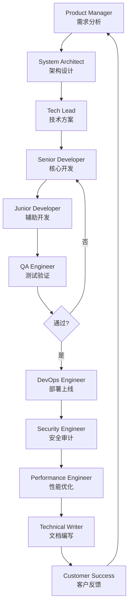
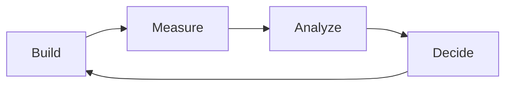

# BMAD Skill - 敏捷AI驱动开发方法论

> 21个专业Agent协同工作，确保代码质量

## 概述

BMAD (Build, Measure, Analyze, Decide) 是一种AI驱动的敏捷开发方法论，通过21个专业Agent角色协同工作，实现高质量的自动化开发。

## 核心理念

### Build（构建）
- AI自动编写代码
- 遵循最佳实践
- 生成单元测试

### Measure（度量）
- 自动运行测试
- 代码质量分析
- 性能基准测试

### Analyze（分析）
- 代码审查
- 安全扫描
- 依赖检查

### Decide（决策）
- 自动决策优化
- 风险评估
- 发布审批

## 21个专业Agent

### 1. 产品管理（Product Management）

#### Product Manager
- **职责**: 需求分析、优先级排序
- **输入**: PRD、用户反馈
- **输出**: 任务列表、优先级

#### Product Owner
- **职责**: 代表用户利益、验收标准
- **输入**: 功能需求
- **输出**: 用户故事、验收条件

### 2. 设计（Design）

#### UX Designer
- **职责**: 用户体验设计
- **输入**: 用户需求
- **输出**: UX流程图、原型

#### UI Designer
- **职责**: 界面设计
- **输入**: UX设计
- **输出**: UI设计稿、样式规范

#### System Architect
- **职责**: 系统架构设计
- **输入**: 技术需求
- **输出**: 架构图、技术选型

### 3. 开发（Development）

#### Tech Lead
- **职责**: 技术决策、代码规范
- **输入**: 架构设计
- **输出**: 技术方案、代码规范

#### Senior Developer
- **职责**: 核心功能开发
- **输入**: 技术方案
- **输出**: 高质量代码

#### Junior Developer
- **职责**: 辅助开发、测试
- **输入**: 任务分配
- **输出**: 代码、测试

#### QA Engineer
- **职责**: 质量保证、测试计划
- **输入**: 功能代码
- **输出**: 测试报告

### 4. DevOps（运维）

#### DevOps Engineer
- **职责**: CI/CD、部署
- **输入**: 代码
- **输出**: 部署脚本、监控

#### Security Engineer
- **职责**: 安全审计、漏洞修复
- **输入**: 代码、依赖
- **输出**: 安全报告、修复方案

#### Performance Engineer
- **职责**: 性能优化
- **输入**: 性能数据
- **输出**: 优化方案

### 5. 数据（Data）

#### Data Engineer
- **职责**: 数据管道、ETL
- **输入**: 数据源
- **输出**: 数据模型、ETL脚本

#### Data Analyst
- **职责**: 数据分析、报表
- **输入**: 数据
- **输出**: 分析报告、可视化

#### ML Engineer
- **职责**: 机器学习模型
- **输入**: 训练数据
- **输出**: ML模型

### 6. 文档（Documentation）

#### Technical Writer
- **职责**: 技术文档
- **输入**: 代码、设计
- **输出**: API文档、用户手册

#### Knowledge Manager
- **职责**: 知识库管理
- **输入**: 文档
- **输出**: 知识库、FAQ

### 7. 项目管理（Project Management）

#### Scrum Master
- **职责**: 敏捷流程、团队协调
- **输入**: 团队状态
- **输出**: Sprint计划、回顾

#### Project Manager
- **职责**: 项目规划、风险管理
- **输入**: 需求、资源
- **输出**: 项目计划、风险报告

### 8. 客户支持（Customer Support）

#### Customer Success Manager
- **职责**: 客户成功、留存
- **输入**: 客户反馈
- **输出**: 客户报告、改进建议

#### Support Engineer
- **职责**: 技术支持、问题解决
- **输入**: 用户问题
- **输出**: 解决方案、FAQ

### 9. 创新（Innovation）

#### Innovation Lead
- **职责**: 技术创新、实验
- **输入**: 市场趋势
- **输出**: 创新方案、POC

## 工作流程

### 标准开发流程



### BMAD循环



## 使用方法

### 在OpenClaw中使用

```python
from skills.bmad import BMADOrchestrator

# 初始化
bmad = BMADOrchestrator()

# 分配任务
task = {
    "type": "feature",
    "description": "实现用户登录",
    "priority": "P0"
}

# 自动分配Agent
agent = bmad.assign_agent(task)

# 执行任务
result = agent.execute(task)
```

### 配置Agent团队

```json
{
  "team": {
    "core": [
      "product-manager",
      "system-architect",
      "tech-lead",
      "senior-developer",
      "qa-engineer"
    ],
    "extended": [
      "devops-engineer",
      "security-engineer",
      "performance-engineer"
    ],
    "specialists": [
      "data-engineer",
      "ml-engineer"
    ]
  },
  "workflow": "standard",
  "quality_gates": [
    "code-review",
    "test-coverage",
    "security-scan"
  ]
}
```

## 质量门禁（Quality Gates）

### 1. 代码审查
- **Reviewer**: Senior Developer + Tech Lead
- **标准**: 
  - 代码风格一致
  - 无重复代码
  - 有适当注释
  - 遵循SOLID原则

### 2. 测试覆盖
- **Reviewer**: QA Engineer
- **标准**:
  - 单元测试覆盖率 > 80%
  - 集成测试通过
  - E2E测试通过
  - 性能测试通过

### 3. 安全扫描
- **Reviewer**: Security Engineer
- **标准**:
  - 无高危漏洞
  - 依赖版本最新
  - 敏感数据加密
  - 权限控制正确

### 4. 性能基准
- **Reviewer**: Performance Engineer
- **标准**:
  - 响应时间 < 200ms
  - 内存使用 < 100MB
  - CPU使用 < 50%
  - 无内存泄漏

## 最佳实践

### 1. Agent选择策略

```python
def select_agent(task):
    if task.type == "feature":
        if task.complexity >= 4:
            return "senior-developer"
        else:
            return "junior-developer"
    elif task.type == "bug":
        return "qa-engineer"
    elif task.type == "security":
        return "security-engineer"
    elif task.type == "performance":
        return "performance-engineer"
```

### 2. 并行执行

```python
# 可以并行的任务
parallel_tasks = [
    ("senior-developer", "核心功能"),
    ("junior-developer", "辅助功能"),
    ("technical-writer", "文档编写")
]

# 并行执行
results = bmad.execute_parallel(parallel_tasks)
```

### 3. 质量优先

```python
# 设置质量门禁
bmad.set_quality_gates([
    "code-review",
    "test-coverage",
    "security-scan",
    "performance-benchmark"
])

# 不达标自动拒绝
result = bmad.execute_with_quality_gates(task)
```

## 配置参考

### config/bmad.json

```json
{
  "agents": {
    "senior-developer": {
      "model": "claude-3-opus",
      "max_tasks": 3,
      "specialties": ["architecture", "core-features"]
    },
    "junior-developer": {
      "model": "claude-3-sonnet",
      "max_tasks": 5,
      "specialties": ["tests", "documentation"]
    }
  },
  "workflows": {
    "standard": [
      "product-manager",
      "system-architect",
      "tech-lead",
      "senior-developer",
      "qa-engineer",
      "devops-engineer"
    ]
  },
  "quality_gates": {
    "enabled": true,
    "strict_mode": true,
    "auto_reject": true
  }
}
```

## 参考资料

- [BMAD-METHOD GitHub](https://github.com/bmad-code-org/BMAD-METHOD)
- [BMAD_Openclaw GitHub](https://github.com/ErwanLorteau/BMAD_Openclaw)
- [敏捷开发最佳实践](./docs/agile-best-practices.md)

---

**版本**: 1.0.0  
**更新日期**: 2026-03-07
