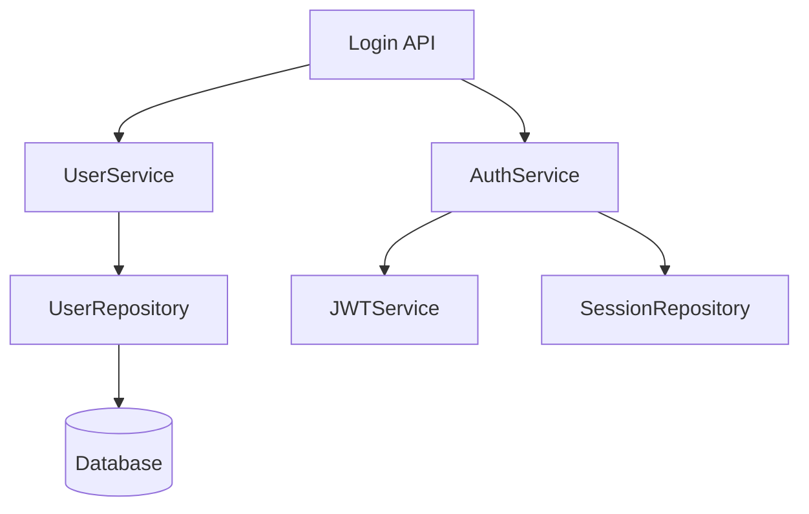

# Spec Driven Development Skill

> 先写规格，后写代码，文档与代码同步

## 概述

Spec Driven Development是一种开发方法论，强调先编写详细的规格文档（Specification），再基于规格编写代码，确保文档、测试和代码三者一致。

## 核心理念

### 1. Spec First
- 先写规格，后写代码
- Spec是契约，不可随意更改
- 代码必须100%符合Spec

### 2. 测试驱动
- 基于Spec自动生成测试
- 测试即文档
- 测试覆盖率100%

### 3. 文档同步
- Spec即文档
- 代码变更必须更新Spec
- 保持三者一致

## Spec格式

### 标准Spec模板

```markdown
# SPEC-001: 用户登录功能

## 元数据
- **ID**: SPEC-001
- **标题**: 用户登录功能
- **优先级**: P0
- **状态**: Draft | Review | Approved | Implemented
- **作者**: AI Agent
- **创建日期**: 2026-03-07
- **更新日期**: 2026-03-07

## 1. 概述

### 1.1 目标
实现用户通过邮箱和密码登录系统。

### 1.2 范围
- 登录页面UI
- 后端API
- Session管理
- 错误处理

### 1.3 非目标
- OAuth登录
- 记住我功能
- 多因素认证

## 2. 功能需求

### 2.1 用户输入
| 字段 | 类型 | 必填 | 验证规则 |
|------|------|------|----------|
| email | string | 是 | 邮箱格式 |
| password | string | 是 | 8-32字符，包含字母和数字 |

### 2.2 业务逻辑

#### 2.2.1 正常流程
1. 用户输入邮箱和密码
2. 系统验证格式
3. 系统查询数据库
4. 系统验证密码（bcrypt）
5. 系统创建Session
6. 系统返回Token和用户信息

#### 2.2.2 异常流程

**场景1: 邮箱不存在**
- 返回: 401 Unauthorized
- 消息: "邮箱或密码错误"（不透露具体原因）

**场景2: 密码错误**
- 返回: 401 Unauthorized
- 消息: "邮箱或密码错误"
- 记录: 登录失败日志

**场景3: 账户被锁定**
- 返回: 403 Forbidden
- 消息: "账户已被锁定，请联系客服"

### 2.3 API规范

#### POST /api/auth/login

**Request:**
```json
{
  "email": "user@example.com",
  "password": "SecurePass123"
}
```

**Response (200 OK):**
```json
{
  "success": true,
  "data": {
    "token": "eyJhbGciOiJIUzI1NiIsInR5cCI6IkpXVCJ9...",
    "user": {
      "id": "123",
      "email": "user@example.com",
      "name": "John Doe",
      "avatar": "https://..."
    }
  }
}
```

**Response (401 Unauthorized):**
```json
{
  "success": false,
  "error": {
    "code": "INVALID_CREDENTIALS",
    "message": "邮箱或密码错误"
  }
}
```

## 3. 技术设计

### 3.1 数据模型

```typescript
interface User {
  id: string;
  email: string;
  password_hash: string;
  name: string;
  avatar?: string;
  status: 'active' | 'locked' | 'deleted';
  created_at: Date;
  updated_at: Date;
}

interface Session {
  id: string;
  user_id: string;
  token: string;
  expires_at: Date;
  created_at: Date;
}
```

### 3.2 依赖关系



### 3.3 安全考虑

1. **密码加密**: 使用bcrypt (cost factor: 12)
2. **Token**: JWT, 有效期7天
3. **Rate Limiting**: 每IP每分钟最多5次
4. **HTTPS**: 必须使用HTTPS
5. **日志**: 记录所有登录尝试

## 4. 测试用例

### 4.1 单元测试

```typescript
describe('AuthService.login', () => {
  it('should return token for valid credentials', async () => {
    const result = await authService.login('user@example.com', 'password');
    expect(result.token).toBeDefined();
    expect(result.user.email).toBe('user@example.com');
  });

  it('should throw error for invalid email', async () => {
    await expect(
      authService.login('invalid@example.com', 'password')
    ).rejects.toThrow('INVALID_CREDENTIALS');
  });

  it('should throw error for invalid password', async () => {
    await expect(
      authService.login('user@example.com', 'wrongpassword')
    ).rejects.toThrow('INVALID_CREDENTIALS');
  });
});
```

### 4.2 集成测试

```typescript
describe('POST /api/auth/login', () => {
  it('should return 200 for valid credentials', async () => {
    const response = await request(app)
      .post('/api/auth/login')
      .send({ email: 'user@example.com', password: 'password' });
    
    expect(response.status).toBe(200);
    expect(response.body.success).toBe(true);
  });
});
```

### 4.3 E2E测试

```typescript
describe('Login Flow', () => {
  it('user can login successfully', async () => {
    await page.goto('/login');
    await page.fill('#email', 'user@example.com');
    await page.fill('#password', 'password');
    await page.click('#login-button');
    await page.waitForNavigation();
    
    expect(page.url()).toBe('/dashboard');
  });
});
```

## 5. 实现清单

### 5.1 后端
- [ ] User模型定义
- [ ] Session模型定义
- [ ] UserService实现
- [ ] AuthService实现
- [ ] JWTService实现
- [ ] /api/auth/login接口
- [ ] 单元测试
- [ ] 集成测试

### 5.2 前端
- [ ] LoginForm组件
- [ ] 表单验证
- [ ] API调用
- [ ] 错误处理
- [ ] Token存储
- [ ] E2E测试

## 6. 验收标准

### 6.1 功能验收
- [ ] 可以用正确邮箱密码登录
- [ ] 错误密码显示正确提示
- [ ] 不存在的邮箱显示正确提示
- [ ] 账户锁定显示正确提示
- [ ] Token有效期7天
- [ ] 登录后跳转到Dashboard

### 6.2 性能验收
- [ ] API响应时间 < 200ms (P95)
- [ ] 并发支持 > 100 req/s

### 6.3 安全验收
- [ ] 所有API使用HTTPS
- [ ] 密码使用bcrypt加密
- [ ] Rate Limiting生效
- [ ] 无敏感信息泄露

### 6.4 质量验收
- [ ] 单元测试覆盖率 > 80%
- [ ] 集成测试通过
- [ ] E2E测试通过
- [ ] 无高危安全漏洞
- [ ] 代码通过Lint检查

## 7. 文档

### 7.1 API文档
- [ ] OpenAPI/Swagger规范
- [ ] 示例请求和响应
- [ ] 错误码说明

### 7.2 用户文档
- [ ] 登录流程说明
- [ ] 常见问题FAQ
- [ ] 故障排查指南

## 8. 发布计划

### 8.1 阶段1: 开发（3天）
- Day 1: 后端API + 单元测试
- Day 2: 前端UI + 集成测试
- Day 3: E2E测试 + Bug修复

### 8.2 阶段2: 测试（1天）
- QA测试
- 性能测试
- 安全扫描

### 8.3 阶段3: 发布（1天）
- 灰度发布（10%用户）
- 监控指标
- 全量发布

## 9. 风险与缓解

| 风险 | 影响 | 概率 | 缓解措施 |
|------|------|------|----------|
| 密码泄露 | 高 | 低 | 使用bcrypt加密 |
| DDoS攻击 | 高 | 中 | Rate Limiting + WAF |
| Session劫持 | 高 | 低 | HTTPS + HttpOnly Cookie |
| 数据库故障 | 高 | 低 | 主从复制 + 自动故障转移 |

## 10. 参考资料

- [OWASP认证最佳实践](https://cheatsheetseries.owasp.org/cheatsheets/Authentication_Cheat_Sheet.html)
- [JWT最佳实践](https://datatracker.ietf.org/doc/html/rfc8725)
- [bcrypt算法说明](https://en.wikipedia.org/wiki/Bcrypt)

---

**审批记录**:
- 2026-03-07: Created by AI Agent
- [ ] Technical Review by Tech Lead
- [ ] Security Review by Security Engineer
- [ ] Final Approval by Product Owner
