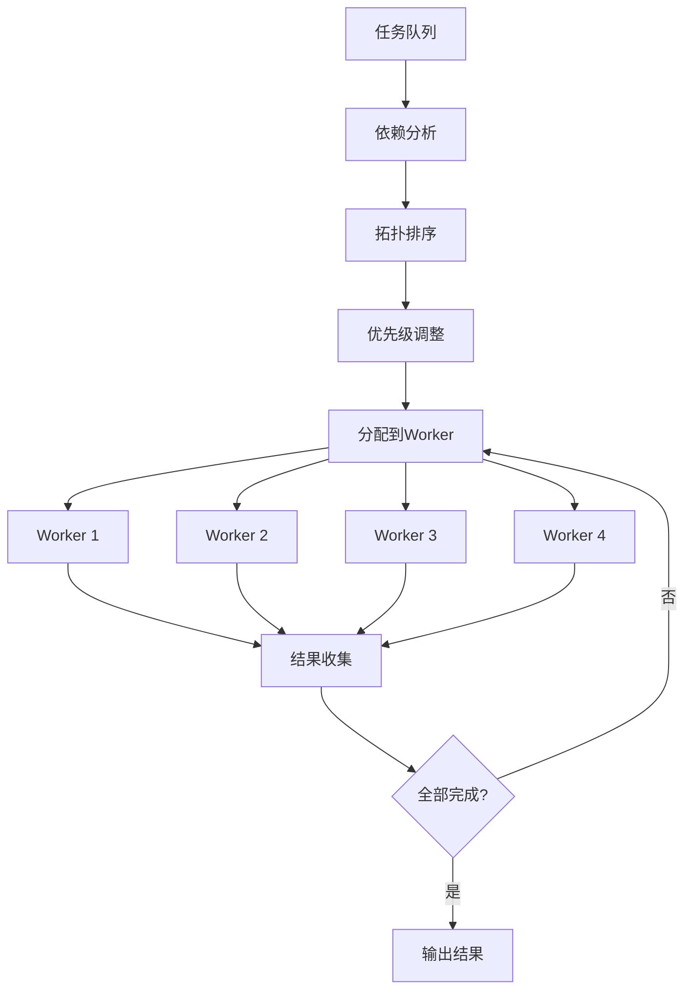

# Symphony Skill - 并行Agent执行引擎

> OpenAI Symphony风格的并行任务执行

## 概述

Symphony是一个并行Agent执行引擎，能够同时运行多个AI Agent，智能调度任务，优化资源使用。

## 核心功能

### 1. 并行执行
- 同时运行多个Agent
- 智能任务分配
- 资源负载均衡

### 2. 依赖管理
- 自动识别任务依赖
- 拓扑排序执行
- 死锁检测和避免

### 3. 容错机制
- Agent失败自动重试
- 降级策略
- 状态恢复

### 4. 性能优化
- 动态调整并发数
- 任务优先级调度
- 资源限制保护

## 使用方法

### 在OpenClaw中使用

```python
from skills.symphony import SymphonyExecutor

# 初始化
symphony = SymphonyExecutor(max_workers=4)

# 添加任务
tasks = [
    {"id": "1", "type": "feature", "description": "用户登录"},
    {"id": "2", "type": "feature", "description": "用户注册"},
    {"id": "3", "type": "feature", "description": "密码重置"}
]

# 并行执行
results = symphony.execute_parallel(tasks)

# 查看结果
for result in results:
    print(f"Task {result.id}: {result.status}")
```

### CLI使用

```bash
# 并行执行任务
symphony run --tasks tasks.json --workers 4

# 查看状态
symphony status

# 暂停/恢复
symphony pause
symphony resume
```

## 配置

### config/symphony.json

```json
{
  "max_workers": 4,
  "task_timeout": 3600,
  "retry_policy": {
    "max_retries": 3,
    "backoff": "exponential",
    "base_delay": 5
  },
  "resource_limits": {
    "max_memory_per_agent": "2GB",
    "max_cpu_per_agent": "50%"
  },
  "scheduling": {
    "algorithm": "priority",
    "preemption": true
  }
}
```

## 任务调度算法

### 1. 优先级调度

```python
def schedule_by_priority(tasks):
    return sorted(tasks, key=lambda t: t.priority, reverse=True)
```

### 2. 拓扑排序

```python
def schedule_by_dependency(tasks):
    # 构建依赖图
    graph = build_dependency_graph(tasks)
    # 拓扑排序
    return topological_sort(graph)
```

### 3. 贪心调度

```python
def schedule_greedy(tasks, workers):
    # 贪心分配任务到空闲worker
    assignments = []
    for task in tasks:
        worker = find_available_worker(workers)
        assignments.append((worker, task))
    return assignments
```

## 工作流程



## 容错机制

### 1. 自动重试

```python
@retry(max_attempts=3, backoff=exponential)
def execute_task(task):
    agent = get_agent(task)
    return agent.execute(task)
```

### 2. 超时保护

```python
@timeout(seconds=3600)
def execute_task(task):
    # 1小时超时
    return agent.execute(task)
```

### 3. 降级策略

```python
def execute_with_fallback(task):
    try:
        # 尝试高级Agent
        return senior_agent.execute(task)
    except Exception:
        # 降级到基础Agent
        return junior_agent.execute(task)
```

## 性能优化

### 1. 动态并发调整

```python
def adjust_workers(current_load, max_workers):
    if current_load < 0.5:
        return min(max_workers, current_workers + 1)
    elif current_load > 0.8:
        return max(1, current_workers - 1)
    return current_workers
```

### 2. 任务批处理

```python
def batch_tasks(tasks, batch_size=5):
    for i in range(0, len(tasks), batch_size):
        yield tasks[i:i+batch_size]
```

### 3. 结果缓存

```python
@cache(ttl=3600)
def execute_cached_task(task):
    return execute_task(task)
```

## 监控指标

### 关键指标

```python
metrics = {
    "active_workers": 4,
    "queued_tasks": 10,
    "completed_tasks": 50,
    "failed_tasks": 2,
    "avg_execution_time": 120,  # 秒
    "throughput": 0.8  # 任务/秒
}
```

### Dashboard展示

```
Symphony Dashboard
┌─────────────────────────────┐
│ Active Workers: 4/4         │
│ Queued Tasks: 10            │
│ Completed: 50  Failed: 2    │
│ Throughput: 0.8 tasks/sec   │
└─────────────────────────────┘
```

## 最佳实践

### 1. 合理设置并发数

```python
# CPU密集型: workers = CPU核心数
# IO密集型: workers = CPU核心数 * 2
# AI Agent: workers = 3-4 (避免API限流)
```

### 2. 任务粒度控制

```python
# 每个任务 30分钟-2小时
# 太大: 并行度低
# 太小: 调度开销大
```

### 3. 依赖最小化

```python
# 理想: 任务完全独立
# 次优: 最小化依赖链
# 避免: 复杂依赖网络
```

## 集成示例

### 与TaskMaster集成

```python
from skills.taskmaster import TaskMaster
from skills.symphony import SymphonyExecutor

# TaskMaster生成任务
tm = TaskMaster("PRD.md")
tasks = tm.generate_tasks()

# Symphony并行执行
symphony = SymphonyExecutor(max_workers=4)
results = symphony.execute_parallel(tasks)
```

### 与BMAD集成

```python
from skills.bmad import BMADOrchestrator
from skills.symphony import SymphonyExecutor

# BMAD分配Agent
bmad = BMADOrchestrator()
symphony = SymphonyExecutor(max_workers=4)

for task in tasks:
    agent = bmad.assign_agent(task)
    symphony.submit(agent, task)

results = symphony.wait_all()
```

## API参考

### SymphonyExecutor类

```python
class SymphonyExecutor:
    def __init__(self, max_workers=4, config=None)
    
    def execute_parallel(self, tasks: List[Task]) -> List[Result]
    def submit(self, agent: Agent, task: Task) -> Future
    def wait_all(self) -> List[Result]
    def pause(self)
    def resume(self)
    def get_status(self) -> Status
```

### Result类

```python
class Result:
    task_id: str
    status: str  # success, failed, timeout
    output: Any
    error: Optional[str]
    execution_time: float
    retry_count: int
```

## 参考资料

- [Symphony GitHub](https://github.com/openai/symphony)
- [并行调度算法](./docs/parallel-scheduling.md)
- [容错设计模式](./docs/fault-tolerance.md)

---

**版本**: 1.0.0  
**更新日期**: 2026-03-07
