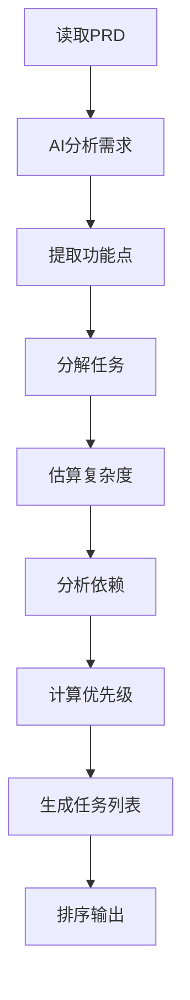

# TaskMaster-AI Skill

> 自动将PRD分解为可执行任务

## 概述

TaskMaster-AI是一个AI驱动的任务管理系统，能够自动分析PRD（产品需求文档），分解为可执行的开发任务，并智能排序优先级。

## 核心功能

### 1. PRD解析
- 自动提取功能需求
- 识别技术约束
- 分析依赖关系

### 2. 任务分解
- 将大任务拆分为小任务
- 每个任务独立可测试
- 估算复杂度（1-5星）

### 3. 优先级排序
- 基于依赖关系
- 基于业务价值
- 基于技术风险

### 4. 进度追踪
- 实时更新任务状态
- 自动计算完成度
- 预测剩余时间

## 使用方法

### 在OpenClaw中使用

```python
from skills.taskmaster import TaskMaster

# 初始化
tm = TaskMaster(prd_path="PRD.md")

# 生成任务列表
tasks = tm.generate_tasks()

# 获取下一个任务
next_task = tm.get_next_task()

# 标记任务完成
tm.complete_task(task_id="1.1")
```

### CLI使用

```bash
# 从PRD生成任务
taskmaster generate --prd PRD.md --output tasks.md

# 查看下一个任务
taskmaster next

# 标记完成
taskmaster complete 1.1

# 查看进度
taskmaster status
```

## 配置

### config/taskmaster.json

```json
{
  "model": "claude-3-opus",
  "max_tasks": 50,
  "priority_weights": {
    "dependency": 0.4,
    "value": 0.3,
    "risk": 0.3
  },
  "complexity_factors": [
    "code_lines",
    "dependencies",
    "test_coverage",
    "documentation"
  ]
}
```

## 任务格式

### 任务模板

```markdown
## Task 1.1: 实现用户登录

**Priority**: P0 (最高)  
**Complexity**: ⭐⭐⭐ (3/5)  
**Estimated Time**: 2小时  
**Dependencies**: None

**描述**:
实现用户登录功能，支持邮箱和密码

**技术实现**:
```typescript
// 后端API
POST /api/auth/login
Body: { email: string, password: string }
Response: { token: string, user: User }
```

**验收标准**:
- [ ] 用户可以用邮箱密码登录
- [ ] 登录失败显示错误信息
- [ ] 登录成功返回token
- [ ] 单元测试覆盖率 > 80%

**相关文件**:
- `backend/routes/auth.ts`
- `backend/models/user.ts`
- `frontend/components/LoginForm.tsx`

**标签**: #auth #backend #frontend #P0
```

## 工作流程



## 集成示例

### 与BMAD集成

```python
from skills.taskmaster import TaskMaster
from skills.bmad import BMADOrchestrator

# TaskMaster生成任务
tm = TaskMaster("PRD.md")
tasks = tm.generate_tasks()

# BMAD分配Agent
bmad = BMADOrchestrator()
for task in tasks:
    agent = bmad.assign_agent(task)
    agent.execute(task)
```

### 与Symphony集成

```python
from skills.symphony import SymphonyExecutor

# 并行执行多个任务
symphony = SymphonyExecutor(max_workers=4)
results = symphony.execute_parallel(tasks)
```

## 最佳实践

### 1. PRD编写
- 使用清晰的标题结构
- 明确功能优先级
- 列出技术约束
- 提供用户故事

### 2. 任务粒度
- 每个任务2-4小时
- 独立可测试
- 明确的验收标准
- 不超过3个依赖

### 3. 优先级管理
- P0: 核心功能，立即执行
- P1: 重要功能，本周完成
- P2: 优化功能，本月完成
- P3: 锦上添花，有空再做

## 故障排查

### 问题：任务分解太细

**解决方案**: 调整`min_task_complexity`参数

```json
{
  "min_task_complexity": 2
}
```

### 问题：依赖关系识别错误

**解决方案**: 在PRD中明确标注依赖

```markdown
## 功能B
**依赖**: 功能A必须完成
```

## API参考

### TaskMaster类

```python
class TaskMaster:
    def __init__(self, prd_path: str, config: dict = None)
    
    def generate_tasks(self) -> List[Task]
    def get_next_task(self) -> Task
    def complete_task(self, task_id: str)
    def get_progress(self) -> Progress
    def update_task(self, task_id: str, status: str)
```

### Task类

```python
class Task:
    id: str
    title: str
    description: str
    priority: str  # P0-P3
    complexity: int  # 1-5
    dependencies: List[str]
    status: str  # todo, in_progress, done
    assignee: str
    files: List[str]
    tags: List[str]
```

## 参考资料

- [TaskMaster-AI GitHub](https://github.com/eyaltoledano/claude-task-master)
- [PRD最佳实践](./docs/prd-best-practices.md)
- [任务分解指南](./docs/task-breakdown-guide.md)

---

**版本**: 1.0.0  
**更新日期**: 2026-03-07
